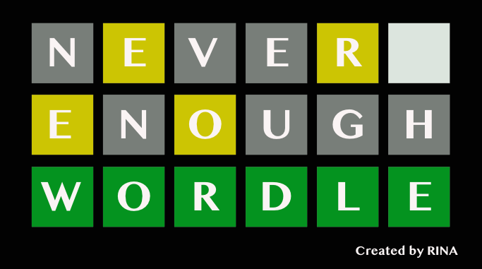

# ga-Wordle
General assembly Project 1 : **Wordle**

Here's the popular game Wordle by RINA, with additional time limit mode.
Hosted on Github pages [here](https://rinasham.github.io/ga-Wordle/)!

### Technical details
This is my first project in General Assembly System Engineering Immersive course. It's written simply with **html, CSS,** and **JavaScript**, being intended to put all the knowledge I've got from the course and help me improve my coding skill.
It also exchange data with indexedDB on Google Chrome. It helped me learn the basic flow of how database works.
It's still in development. < under construction~~

### To Do
- More CSS animations
- Expansion in questions
- Sound effects

